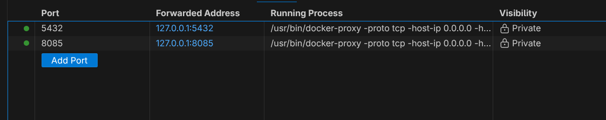
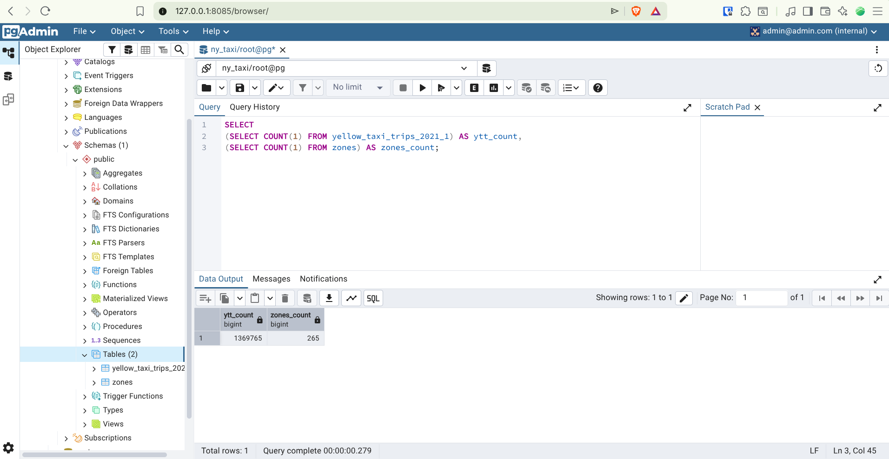

# SQL Refresher – Practice Database

The purpose of this folder is to provide the data that **Alexey** was working with during the **SQL Refresher lecture**.

---

## Getting the Data

You can obtain this folder in one of the following ways:

- Clone the folder using Git by following this tutorial:  
  [Git Clone Tutorial](https://github.com/orgs/community/discussions/102639)

- Or download it directly using this link:  
  [Download the Folder](https://downgit.github.io/#/home?url=https://github.com/Abdelrahman-Abdeljawad/data-engineering-zoomcamp-codes-hws/tree/main/module-01/sql)

---

## Running the Containers

After downloading or cloning the folder, run the following commands:

```bash
docker compose build
docker compose up
```

---

## Accessing pgAdmin

Once the containers are running, open your browser and go to:

```
http://127.0.0.1:8085
```

Alternatively, you can get the link from here:



---

## pgAdmin Configuration

Inside pgAdmin:

1. Create a **new server**
2. Configure it **exactly as shown in Lecture One**

After completing these steps, your **database will be ready and available in pgAdmin**.

---

## Result



You now have the same database setup used during the **SQL Refresher lecture**, ready for practice and experimentation.
